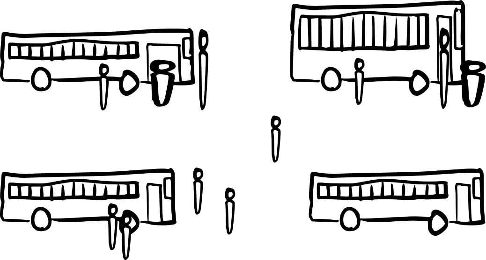

---
title: English quantifiers -- Bus example
...

What does the statement "everyone can fit in a bus" mean?

# Partition

Everyone can fit in a bus by dividing people between buses

This is formalized in mathematics as a partition problem:
given a set of buses and a set of people,
find a mapping between people and buses that satisfied capacity constraints.

# Any can fit the set

Everyone can fit in a bus, so we only need one bus.

This is formalized in mathematics by saying the "fit in a bus" predicate applies to an entire set of people rather than to individual people.

# Any can fit each

Everyone can fit in a bus, even the largest person in the world.

This is formalized in mathematics by saying the "fit in a bus" predicate applies to any person we happen to pick, but individually instead of as a group.

# One can fit the set

Everyone can fit in a bus, so we only need one of the big buses.

When we say "a bus" we mean one bus, but do we mean a special specific bus or any arbitrary bus we could pick? In math, we distingusih these two ideas with different symbols: "$\forall x$" means "no matter which $x$ we pick"
and "$\exists x$" means "it is possible to pick the right $x$".

# One can fits each

Everyone can fit in a bus; even the largest person in the world can fit on a big bus

When we say "a bus" we mean one bus, but do we mean a special specific bus or any arbitrary bus we could pick? In math, we distingusih these two ideas with different symbols: "$\forall x$" means "no matter which $x$ we pick"
and "$\exists x$" means "it is possible to pick the right $x$".

# Each has one that fits

Everyone can fit in a bus; there are tall buses for tall people, wide buses for wide people, and so on.

Is there one specific bus that any person can fit into, or might there be different buses for differently shaped people? These two ideas are distinguished by the order of the $\forall$ and $\exists$ symbol: the left-most one applies to the entire expression that follows.

