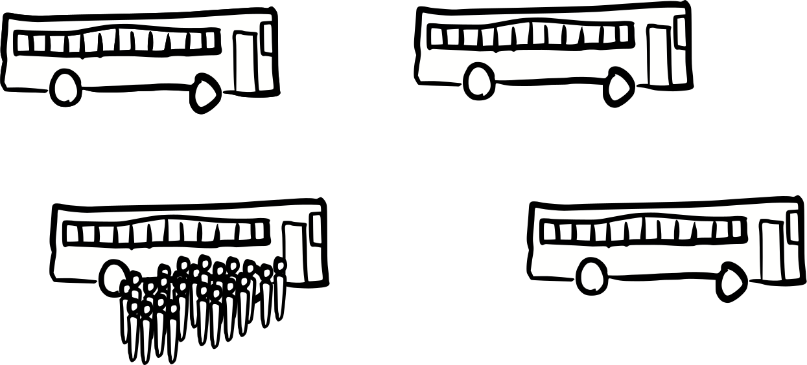
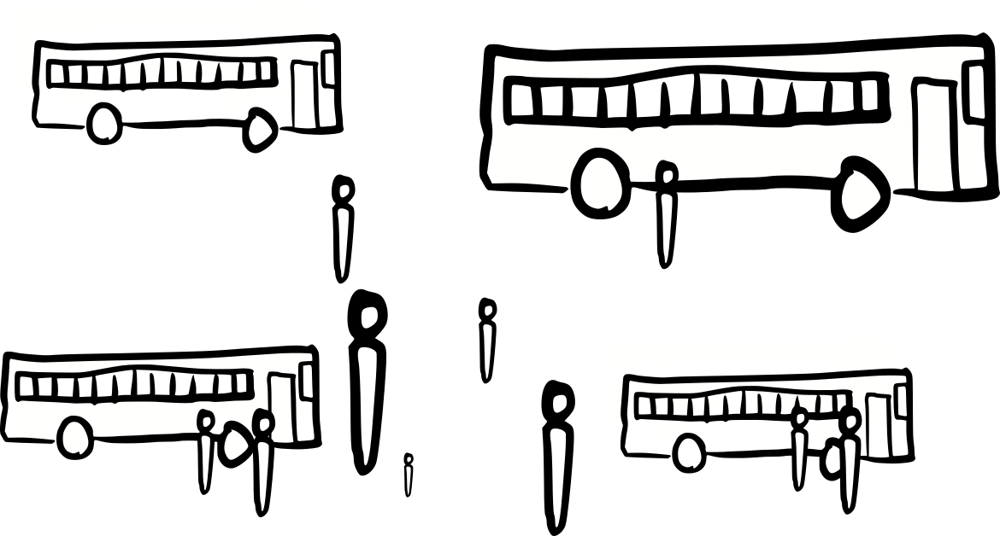

---
title: Everyone can fit in a bus
...

Question
:   What does the statement "everyone can fit in a bus" mean?

Answer
:   It depends on **context**.

Question
:   What is "context"?

Answer
:   A change in the likely meaning of an ambiguous word or situation based on other nearby words or situations.

Question
:   How do we learn what context means?

Answer
:   Some meaning may be intrinsic ("this part has to mean $x$ or that part wouldn't make sense"), but much is **cultural** – that is, based on likely-to-be-shared past experience ("I usually see $x$, so that probably holds here")
    
    For example, my culture leads me to expect "everyone can fit in a \_\_\_\_" to mean

    Everyone can fit in a   Suggests (to me)
    -----------             -----------------
    car                     [Partition]: several cars, more car seats than people
    costume                 [Any can fit each]: costumes are baggy enough for any build
    auditorium              [Any can fit the set]: each auditorium has more seats than we have people

    However, that interpretation is not intrinsic in the words: your experience may lead you to understand these differently.

Question
:   How can I communicate clearly if I don't share a culture?

Answer
:   Learn about other cultures.

    Or, if you have time, learn a common **jargon**: special in-discipline words or symbols that have clearly defined meaning. Jargon lets me communicate across cultures reliably, but also creates a barrier to entry. With English I can communicate easily with people *raised* like me; with jargon I can communicate easily with people *educated* like me.
    
    CS has a lot of its own jargon, mostly based on redefining words and symbols from English (e.g. "else") and math (e.g. "=").
    It also uses some jargon from Mathematics and Formal Logic.

What follows is an effort to illustrate one specific phrase and how context changes its meaning, together with examples of how these might be expressed using discrete mathematics.

# Partition

> Everyone can fit in a bus by dividing people between buses

This is formalized in mathematics as a partition problem:
given a set of buses and a set of people,
find a mapping between people and buses that satisfied capacity constraints.

Partitions are an important enough concept we have specific jargon for them, but that jargon will not be covered in this course.
However, that jargon is defined in terms of discrete mathematics, so we can still express this using this courses' content, although the result is rather complicated:

Let $B$ be the set of buses, $P$ be the set of people, and $c : B \rightarrow \mathbb N$ be a function giving the capacity of a bus. 
Then this case is
$$
\color{blue} \exists f : B \rightarrow \mathcal P(P) \;.\;
\color{red} \Big(\forall b \in B \;.\; \color{orange} \big|f(b)\big| \le c(b)\Big)
\color{green} \land
\color{magenta} \big(\forall p \in P \;.\; \color{purple} \exists b \in B \;.\; \color{brown} p \in f(b)\big)
$$

That is, "[there's some mapping from buses to sets of people
such that]{style="color:blue"}
[both]{style="color:green"}
(a) 
[the number of people mapped from]{style="color:orange"}
[each bus]{style="color:red"}
[is within the bus's capacity]{style="color:orange"}
[and]{style="color:green"}
(b)
[every person]{style="color:magenta"}
[is in the set mapped to by]{style="color:brown"}
[some bus]{style="color:purple"}."

# Any can fit the set

> Everyone can fit in a bus, so we only need one bus.

This is formalized in mathematics by saying the "fit in a bus" predicate applies to an entire set of people rather than to individual people.

Let $B$ be the set of buses, $P$ be the set of people, and $f(x,y)$ be a predicate asserting $x$ can fit in $y$.
Then this case is $$\forall b \in B \;.\; f(P,b)$$

# Any can fit each

> Everyone can fit in a bus, even the largest person in the world.

This is formalized in mathematics by saying the "fit in a bus" predicate applies to any person we happen to pick, but individually instead of as a group.

Let $B$ be the set of buses, $P$ be the set of people, and $f(x,y)$ be a predicate asserting $x$ can fit in $y$.
Then this case is $$\forall p \in P, b \in B \;.\; f(p,b)$$

# One can fit the set

> Everyone can fit in a bus, so we only need one of the big buses.

When we say "a bus" we mean one bus, but do we mean a special specific bus or any arbitrary bus we could pick? In math, we distingusih these two ideas with different symbols: "$\forall x$" means "no matter which $x$ we pick"
and "$\exists x$" means "it is possible to pick the right $x$".

Let $B$ be the set of buses, $P$ be the set of people, and $f(x,y)$ be a predicate asserting $x$ can fit in $y$.
Then this case is $$\exists b \in B \;.\; f(P,b)$$

# One can fits each

> Everyone can fit in a bus; even the largest person in the world can fit on a big bus

When we say "a bus" we mean one bus, but do we mean a special specific bus or any arbitrary bus we could pick? In math, we distingusih these two ideas with different symbols: "$\forall x$" means "no matter which $x$ we pick"
and "$\exists x$" means "it is possible to pick the right $x$".

Let $B$ be the set of buses, $P$ be the set of people, and $f(x,y)$ be a predicate asserting $x$ can fit in $y$.
Then this case is $$\exists b \in B \;.\; \forall p \in P \;.\; f(p,b)$$

# Each has one that fits

> Everyone can fit in a bus; there are buses with high doors and ceilings for tall people, buses with wide doors and aisles for wide people, and so on.

Is there one specific bus that any person can fit into, or might there be different buses for differently shaped people? These two ideas are distinguished by the order of the $\forall$ and $\exists$ symbol: the left-most one applies to the entire expression that follows.

Let $B$ be the set of buses, $P$ be the set of people, and $f(x,y)$ be a predicate asserting $x$ can fit in $y$.
Then this case is $$\forall p \in P \;.\; \exists b \in B \;.\; f(p,b)$$
