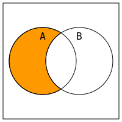
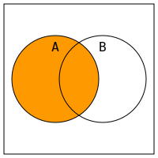
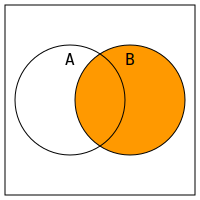
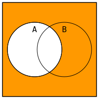
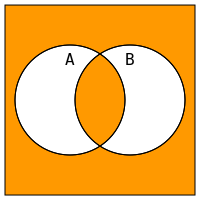
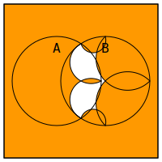

---
title: Venn Diagrams
...

Venn diagrams are often used to illustrate sets.

The basic concept of a Venn diagram is to draw overlapping shapes,
one for each set, and use the overlap to discuss various concepts.

There are three main techniques used within those shapes to illustrate additional ideas:

- The way shapes overlap can be adjusted to indicate some combinations are impossible
- Coloration can be used to indicate overlap that meets some property
- Labeled markers can be placed within shapes to show what sets specific ideas belong to
- Unlabeled markers can be placed within shapes to indicate possible patterns

: Set-Creating Operators

|Operator|New set highlighted|
|:------:|:-----------------:|
|$A \cap B$|  |
|$A \cup B$|  |
|$A \setminus B$|  |
|$B \setminus A$|  |

: Set-Limiting Predicates

|Predicate|Picture where true|
|:------:|:-----------------:|
|$A \subseteq B$|  |
|$A \supseteq B$|  |
|$A = B$|  |
|$A \cap B = \emptyset$|  |

: Sets as Propositions

|Expression|Colored where true|Universally True|
|:--------:|:----------------:|:--------------:|
|$A$|  |  |
|$B$|  |  |
|$\lnot A$|  |  |
|$\lnot B$|  |  |
|$A \land B$|  |  |
|$A \lor B$|  | |
|$A \leftrightarrow B$|  |  |
|$A \oplus B$|  |  |
|$A \rightarrow B$|  |  |
|$B \rightarrow A$|  |  |
